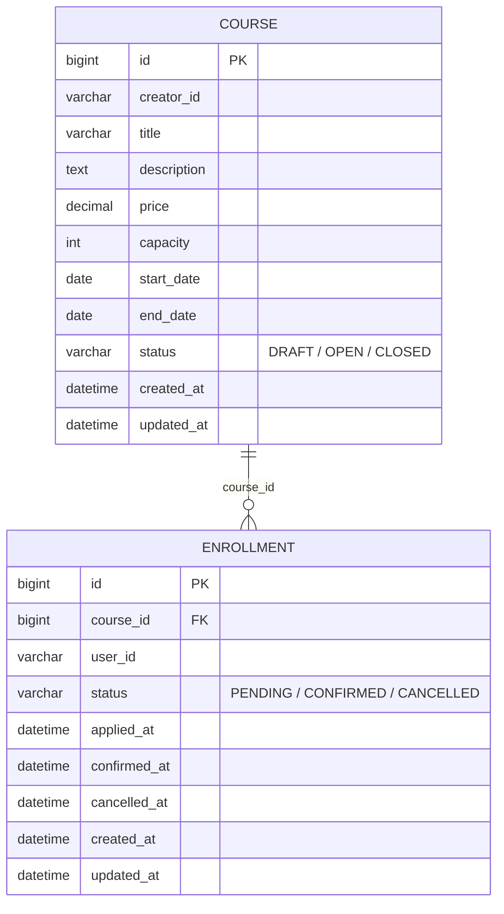

# 수강 신청 시스템 (Enrollment)

라이브클래스 백엔드 채용 과제 — **과제 A: 수강 신청 시스템**

## 프로젝트 개요

크리에이터가 강의를 개설(정원/가격/기간 설정)하고, 수강생이 강의에 신청해 결제를 확정하면 수강이 확정되는 시스템입니다.
핵심은 **동시에 여러 명이 마지막 한 자리에 신청해도 정원을 초과하지 않는 것**이며, 이를 DB 비관적 락으로 직렬화해 해결했습니다.

- 강의(Course): 개설 → 모집(`OPEN`) → 마감(`CLOSED`)
- 수강 신청(Enrollment): 신청(`PENDING`) → 결제확정(`CONFIRMED`) → 취소(`CANCELLED`)

## 기술 스택

| 영역 | 사용 기술 |
|---|---|
| 언어/프레임워크 | Java 21, Spring Boot 3.2.5 |
| 웹 | Spring MVC (REST API) |
| 인증 | Spring Security + JWT (jjwt) |
| 영속성 | Spring Data JPA (Hibernate) |
| DB | MySQL 8 (Docker Compose) / H2 (테스트) |
| 스키마 관리 | Flyway |
| API 문서 | springdoc-openapi (Swagger UI) |
| 빌드 | Gradle (Wrapper 포함) |
| 테스트 | JUnit 5, Mockito, AssertJ, Spring Test(MockMvc) |

## 실행 방법

### 1. MySQL 기동

```bash
docker compose up -d
```

`enrollment` DB / `enrollment` 계정으로 자동 구성됩니다 (`docker-compose.yml` 참고). 애플리케이션 기동 시 Flyway가
`src/main/resources/db/migration`의 스키마를 자동 적용합니다.

### 2. 애플리케이션 실행

```bash
./gradlew bootRun
```

기본적으로 `local` 프로필(`application-local.yml`)이 활성화되어 위 MySQL에 접속합니다.

- API 서버: http://localhost:8080
- Swagger UI: http://localhost:8080/swagger-ui.html
- OpenAPI 스펙: http://localhost:8080/v3/api-docs

JWT 서명 키는 환경변수 `JWT_SECRET`으로 주입할 수 있습니다(미설정 시 로컬 개발용 기본값 사용, `application.yml` 참고).

```bash
JWT_SECRET=change-me-in-real-deployment ./gradlew bootRun
```

### 3. 테스트 실행

```bash
./gradlew test
```

테스트는 `test` 프로필(H2 인메모리)로 동작하므로 MySQL이 없어도 실행됩니다.

```bash
# 특정 클래스만 실행
./gradlew test --tests "com.liveklass.enrollment.enrollment.EnrollmentConcurrencyTest"
```

## API 목록 및 예시

모든 API(로그인 제외)는 `Authorization: Bearer <token>` 헤더가 필요합니다. 토큰은 `POST /api/auth/token`으로 발급받습니다.

| Method | Path | 설명 | 인증 |
|---|---|---|---|
| POST | `/api/auth/token` | userId로 JWT 발급(간이 로그인) | - |
| POST | `/api/courses` | 강의 개설 | O (개설자) |
| GET | `/api/courses` | 강의 목록 조회 (`status` 필터, 페이지네이션) | O |
| GET | `/api/courses/{courseId}` | 강의 상세 조회 (현재 신청 인원 포함) | O |
| POST | `/api/courses/{courseId}/open` | 모집 시작 (DRAFT→OPEN) | O (개설자 본인만) |
| POST | `/api/courses/{courseId}/close` | 모집 마감 (OPEN→CLOSED) | O (개설자 본인만) |
| GET | `/api/courses/{courseId}/enrollments` | 강의별 수강생 목록 (선택 구현) | O (개설자 본인만) |
| POST | `/api/enrollments` | 수강 신청 | O |
| POST | `/api/enrollments/{id}/confirm` | 결제 확정 (PENDING→CONFIRMED) | O (신청자 본인만) |
| POST | `/api/enrollments/{id}/cancel` | 수강 취소 | O (신청자 본인만) |
| GET | `/api/enrollments/me` | 내 수강 신청 목록 (선택 구현: 페이지네이션) | O |

### 예시: 로그인 → 강의 개설 → 신청 → 정원 초과

```bash
# 1. 토큰 발급
curl -X POST http://localhost:8080/api/auth/token \
  -H "Content-Type: application/json" \
  -d '{"userId":"creator-1"}'
# -> {"accessToken":"eyJhbGciOi...","tokenType":"Bearer"}

# 2. 강의 개설 (capacity=2)
curl -X POST http://localhost:8080/api/courses \
  -H "Authorization: Bearer $TOKEN" -H "Content-Type: application/json" \
  -d '{"title":"실전 스프링 부트","description":"백엔드 실무 강의","price":50000,"capacity":2,"startDate":"2026-09-01","endDate":"2026-10-01"}'
# -> {"id":1,"creatorId":"creator-1","title":"실전 스프링 부트","price":50000,"capacity":2,"startDate":"2026-09-01","endDate":"2026-10-01","status":"DRAFT"}

# 3. 모집 시작
curl -X POST http://localhost:8080/api/courses/1/open -H "Authorization: Bearer $TOKEN"
# -> {"...", "status":"OPEN"}

# 4. student-1, student-2 신청 -> 둘 다 성공(PENDING)
# 5. student-3 신청 -> 정원 초과로 409
curl -i -X POST http://localhost:8080/api/enrollments \
  -H "Authorization: Bearer $STUDENT3_TOKEN" -H "Content-Type: application/json" \
  -d '{"courseId":1}'
# -> HTTP/1.1 409
# -> {"type":"about:blank","title":"Conflict","status":409,
#     "detail":"정원이 마감되어 신청할 수 없습니다. courseId=1","instance":"/api/enrollments"}
```

위 예시는 실제로 로컬 MySQL에 대해 실행해 확인한 결과입니다. 전체 API 스펙은 Swagger UI에서 직접 호출하며 확인할 수 있습니다.

## 데이터 모델 설명



- `Enrollment.course_id`는 JPA `@ManyToOne` 연관관계가 아니라 **평범한 컬럼**입니다. 지연로딩 프록시로 인한 N+1을 원천 차단하고, 조회 쿼리를 서비스 레이어에서 명시적으로 제어하기 위한 선택입니다.
- 인덱스
  - `enrollment(course_id, status)`: 정원 계산(`countByCourseIdAndStatusIn`)과 강의별 수강생 조회가 가장 자주 타는 인덱스
  - `enrollment(user_id)`: 내 신청 목록 조회
  - `course(status)`: 강의 목록 상태 필터
- `status` 컬럼은 MySQL 네이티브 `ENUM` 대신 `VARCHAR`로 매핑했습니다. 상태값을 추가할 때 `ALTER TABLE ... MODIFY ENUM(...)` 없이 애플리케이션 코드 변경만으로 확장할 수 있습니다.

## 요구사항 해석 및 가정

- **정원 계산 기준**: `PENDING`(결제 대기) + `CONFIRMED`(결제 확정) 상태를 모두 정원에 포함시켰습니다. 결제 대기 중에도 자리를 비워두면 안 된다고 해석했습니다. `CANCELLED`만 정원에서 제외됩니다.
- **중복 신청 방지**: 한 사용자가 동일 강의에 대해 `PENDING`/`CONFIRMED` 상태의 신청을 동시에 두 개 이상 가질 수 없습니다(취소 후 재신청은 허용).
- **결제**: 실제 PG 연동 없이, "결제 확정" API 호출을 결제 완료로 간주해 상태만 전이시킵니다(과제 제약사항에 명시된 대로).
- **강의 상태 전이는 단방향**입니다(`DRAFT`→`OPEN`→`CLOSED`, 역방향 불가). 마감된 강의를 다시 열어야 하는 요구사항은 과제 범위에 없다고 판단했습니다.
- **인증/인가**: 과제 제약사항은 `userId`를 헤더로 전달하는 간이 방식을 허용하지만, JD의 "Spring Security 기반 인증/인가" 요건에 맞춰 JWT 발급/검증 방식으로 구현했습니다. 다만 회원가입·비밀번호 체계는 과제 범위 밖이라, `userId`만 넘기면 토큰을 발급하는 간이 로그인(`POST /api/auth/token`)으로 대체했습니다. 실제 서비스라면 이 자리에 자격 증명 검증이 들어갑니다.
- **취소 가능 기간**(선택 구현): 결제 확정 시점 기준 7일 이내만 취소 가능하도록 구현했습니다(`enrollment.cancellable-days` 설정으로 조정 가능). `PENDING` 상태(결제 전)는 기간 제한 없이 취소할 수 있습니다.

## 설계 결정과 이유

### 동시성 제어 — 비관적 락

수강 신청 시 `Course` row에 `SELECT ... FOR UPDATE`(비관적 락, `CourseRepository#findByIdForUpdate`)를 걸고, 같은 트랜잭션 안에서
"현재 신청 인원 카운트 → 정원 비교 → 신청 생성"을 수행합니다. 동시에 여러 요청이 마지막 자리를 신청해도 이 락 때문에 한 번에 하나씩만
통과하므로 오버셀이 발생하지 않습니다. `EnrollmentConcurrencyTest`에서 정원 5명 강의에 30명이 동시에 신청해도 정확히 5명만
성공하는 것을 검증합니다.

대안으로 다음을 검토했습니다.

| 방식 | 장점 | 단점 | 채택 여부 |
|---|---|---|---|
| 비관적 락 (`SELECT FOR UPDATE`) | 구현이 단순하고 오버셀을 확실히 방지 | 락 대기로 인한 처리량 저하(동시 신청이 몰리는 짧은 순간에 한정) | **채택** |
| 낙관적 락(`@Version`) + 재시도 | 락 대기 없음, 처리량 유리 | 충돌 시 재시도 로직 필요, 실패율이 정원 마감 직전에 급증 | 미채택(과제 스코프상 단순함 우선) |
| Redis 분산락 | 다중 인스턴스/수평 확장에 유리 | 별도 인프라 필요, 과제 제약사항("실제 브로커/캐시 설치 불필요")과 맞지 않음 | 미채택(멀티 인스턴스 확장 시 고려 대상으로 남김) |

단일 인스턴스·단일 DB라는 과제 스코프에서는 비관적 락이 가장 단순하면서도 확실하게 요구사항을 만족시킵니다.

### 아키텍처 스타일 — DDD-lite

리포지토리 인터페이스를 domain에 두고 JPA 구현체를 infrastructure로 분리하는 완전한 헥사고날 구조 대신,
패키지(`course`, `enrollment`)를 바운디드 컨텍스트로 삼고 JPA 엔티티 자체에 상태 전이·불변식을 캡슐화하는 방식을 선택했습니다
(`Course.open()/close()`, `Enrollment.confirm()/cancel()`이 스스로 상태 전이 규칙을 검증). 엔티티 2개짜리 과제 스코프에서 풀
헥사고날은 오버엔지니어링이라고 판단했습니다.

### 시간 의존 로직의 테스트 가능성

서비스에서 `LocalDateTime.now()`를 직접 호출하지 않고 `Clock` 빈(`ClockConfig`)을 주입받아 사용합니다. 테스트에서
`Clock.fixed(...)`로 교체해 취소 가능 기간(7일) 경계값을 결정적으로 검증할 수 있습니다.

### 에러 응답 포맷

Spring 6의 `ProblemDetail`(RFC 7807)을 사용해 일관된 에러 응답 포맷(`type`, `title`, `status`, `detail`, `instance`)을
제공합니다. 별도 커스텀 에러 DTO를 만들지 않고 표준을 따랐습니다.

### record 사용 범위

요청/응답 DTO(`CourseCreateRequest`, `CourseResponse`, `EnrollmentRequest`, `TokenResponse` 등)는 모두 Java `record`로
작성했습니다. 반면 JPA 엔티티(`Course`, `Enrollment`)는 record로 만들지 않았습니다. record는 암묵적으로 `final`이라 Hibernate가
지연로딩 프록시를 만들 서브클래스를 생성할 수 없고, 모든 필드가 불변이라 변경 감지(dirty checking)도 불가능해 JPA 스펙상
엔티티로 쓸 수 없기 때문입니다. 대신 엔티티에는 `open()`/`confirm()`/`cancel()`처럼 상태 전이 규칙을 캡슐화한 메서드를 두어
불변식을 지켰습니다.

### QueryDSL 미사용

리포지토리 쿼리가 `findByStatus`, `countByCourseIdAndStatusIn`처럼 필드 1~2개짜리 단순 파생 쿼리뿐이고, 연관관계가 없어
join도 발생하지 않습니다. QueryDSL은 여러 optional 조건을 조합하는 동적 검색이나 복잡한 join/projection에서 값어치를 하는데
지금 스코프에는 해당하지 않아 도입하지 않았습니다. 이후 강의 검색에 "제목 키워드 + 가격범위 + 기간 + 상태"처럼 optional 필드가
여러 개 조합되는 요구가 생기면 `BooleanBuilder` 기반 동적 쿼리로 전환할 지점으로 남겨둡니다.

## 테스트 실행 방법

```bash
./gradlew test
```

- `CourseTest`, `EnrollmentTest`: 엔티티 단위(상태 전이, 취소 가능 기간 경계값)
- `CourseServiceTest`, `EnrollmentServiceTest`: 서비스 단위(Mockito), 예외 케이스 포함
- `EnrollmentConcurrencyTest`: **정원 5명 강의에 30개 동시 요청 → 정확히 5건만 성공**하는지 검증하는 동시성 테스트
- `EnrollmentFlowIntegrationTest`: 로그인부터 강의 개설~취소까지 MockMvc로 실제 API를 호출하는 통합 테스트

## 미구현 / 제약사항

- **대기열(waitlist)**: 미구현. 정원 초과 시 즉시 거부만 하며, 취소 발생 시 대기자에게 자리를 자동 배정하는 기능은 없습니다.
- **알림/이메일**: 신청·확정·취소에 대한 알림 발송은 과제 A 범위가 아니라 구현하지 않았습니다.
- **회원가입/비밀번호 인증**: 위 "요구사항 해석 및 가정" 참고 — `userId` 기반 간이 로그인만 있습니다.
- **다중 인스턴스 환경**: 비관적 락은 단일 DB 기준으로는 안전하지만, DB를 샤딩하거나 리드/라이트를 분리하는 구성에서는 별도 검토가 필요합니다(Redis 분산락 등).
- **강의 상태 역행**: `CLOSED`에서 `OPEN`으로 되돌리는 기능은 없습니다.

구현한 선택 항목: 수강 취소 가능 기간 제한, 강의별 수강생 목록 조회(크리에이터 전용), 신청 내역 페이지네이션.

## AI 활용 범위

Claude Code(AI 코딩 어시스턴트)를 활용해 요구사항 분석, 아키텍처/동시성 제어 방식 설계, 도메인 모델·서비스·컨트롤러·테스트
코드 작성 전반에 도움을 받았습니다. 작성된 코드는 로컬에서 직접 빌드·테스트하고, 실제 MySQL을 띄워 API를 수동으로 호출해
동작을 확인했습니다.
