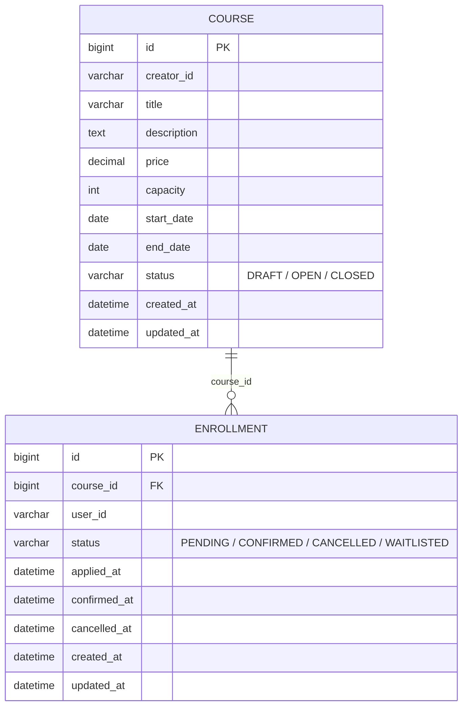

# 수강 신청 시스템 (Enrollment)

라이브클래스 백엔드 채용 과제 — **과제 A: 수강 신청 시스템**

## 프로젝트 개요

크리에이터가 강의를 개설(정원/가격/기간 설정)하고, 수강생이 강의에 신청해 결제를 확정하면 수강이 확정되는 시스템입니다.
핵심은 **동시에 여러 명이 마지막 한 자리에 신청해도 정원을 초과하지 않는 것**이며, 이를 DB 비관적 락으로 직렬화해 해결했습니다.

- 강의(Course): 개설 → 모집(`OPEN`) → 마감(`CLOSED`)
- 수강 신청(Enrollment): 신청(`PENDING`) → 결제확정(`CONFIRMED`) → 취소(`CANCELLED`)

## 기술 스택

| 영역 | 사용 기술 |
|---|---|
| 언어/프레임워크 | Java 21, Spring Boot 3.2.5 |
| 웹 | Spring MVC (REST API) |
| 인증 | Spring Security + JWT (jjwt) |
| 영속성 | Spring Data JPA (Hibernate) |
| DB | MySQL 8 (Docker Compose) / H2 (테스트) |
| 스키마 관리 | Flyway |
| API 문서 | springdoc-openapi (Swagger UI) |
| 빌드 | Gradle (Wrapper 포함) |
| 테스트 | JUnit 5, Mockito, AssertJ, Spring Test(MockMvc) |

## 실행 방법

### 0. 환경변수 설정

DB 비밀번호, JWT 서명 키 등은 `docker-compose.yml`에 하드코딩하지 않고 `.env`로 분리했습니다. 최초 1회만 실행하면 됩니다.

```bash
cp .env.example .env
```

`.env`는 `.gitignore`에 등록되어 있어 커밋되지 않습니다. `.env.example`에 필요한 키 목록과 로컬 개발용 기본값이 정리되어 있으니,
운영 배포 시에는 이 값들을(특히 `JWT_SECRET`) 실제 비밀값으로 교체해서 사용하면 됩니다.

### 방법 A. Docker Compose 한 번에 실행 (권장)

```bash
docker compose up --build
```

MySQL + 애플리케이션이 한 번에 뜹니다. `docker compose`가 `.env`를 자동으로 읽어 두 컨테이너에 주입하고, 앱 컨테이너는
MySQL의 헬스체크(`service_healthy`)를 기다렸다가 기동하며, Flyway가 `src/main/resources/db/migration`의 스키마를 자동
적용합니다. 별도 JDK/Gradle 설치 없이 Docker만 있으면 됩니다.

```bash
docker compose down          # 컨테이너 정리 (데이터는 볼륨에 유지)
docker compose down -v       # 데이터까지 완전 초기화
```

### 방법 B. 로컬에서 실행 (DB만 Docker)

```bash
docker compose up -d mysql
```

`enrollment` DB / `enrollment` 계정으로 자동 구성됩니다 (`docker-compose.yml` 참고).

```bash
./gradlew bootRun
```

기본적으로 `local` 프로필(`application-local.yml`)이 활성화되어 위 MySQL에 접속합니다. `.env`를 기본값 그대로
쓰면 별도 설정 없이 붙지만, `.env`의 `MYSQL_USER`/`MYSQL_PASSWORD`/`MYSQL_DATABASE`를 바꿨다면 이 경로(로컬
gradle 실행)는 `.env`를 자동으로 읽지 않으므로 같은 값을 환경변수로 직접 export하고 실행해야 합니다.

```bash
set -a && source .env && set +a && ./gradlew bootRun
```

두 방법 모두 공통:

- API 서버: http://localhost:8080
- Swagger UI: http://localhost:8080/swagger-ui.html
- OpenAPI 스펙: http://localhost:8080/v3/api-docs

JWT 서명 키는 환경변수 `JWT_SECRET`으로 주입할 수 있습니다(미설정 시 로컬 개발용 기본값 사용, `application.yml` 참고).

```bash
JWT_SECRET=change-me-in-real-deployment ./gradlew bootRun
# 또는
JWT_SECRET=change-me-in-real-deployment docker compose up --build
```

### 테스트 실행

```bash
./gradlew test
```

테스트는 `test` 프로필(H2 인메모리)로 동작하므로 MySQL이 없어도 실행됩니다. Hibernate가 즉석에서 만든 스키마가 아니라
**실제 배포되는 `db/migration/V1__init_schema.sql`을 Flyway로 H2에 그대로 적용**하고 `ddl-auto: validate`로 엔티티
매핑과 일치하는지 검증합니다. 마이그레이션 스크립트에 오타나 타입 불일치가 생기면 테스트 스위트가 `SchemaManagementException`으로
바로 잡아냅니다(실제로 `price` 컬럼 타입을 일부러 틀리게 바꿔서 테스트가 즉시 실패하는 것을 확인한 뒤 되돌렸습니다).

```bash
# 특정 클래스만 실행
./gradlew test --tests "com.liveklass.enrollment.enrollment.EnrollmentConcurrencyTest"
```

## API 목록 및 예시

모든 API(로그인 제외)는 `Authorization: Bearer <token>` 헤더가 필요합니다. 토큰은 `POST /api/auth/token`으로 발급받습니다.

| Method | Path | 설명 | 인증 |
|---|---|---|---|
| POST | `/api/auth/token` | userId로 JWT 발급(간이 로그인) | - |
| POST | `/api/courses` | 강의 개설 | O (개설자) |
| GET | `/api/courses` | 강의 목록 조회 (`status` 필터, 페이지네이션) | O |
| GET | `/api/courses/{courseId}` | 강의 상세 조회 (현재 신청 인원 포함) | O |
| POST | `/api/courses/{courseId}/open` | 모집 시작 (DRAFT→OPEN) | O (개설자 본인만) |
| POST | `/api/courses/{courseId}/close` | 모집 마감 (OPEN→CLOSED) | O (개설자 본인만) |
| GET | `/api/courses/{courseId}/enrollments` | 강의별 수강생 목록 (선택 구현) | O (개설자 본인만) |
| POST | `/api/enrollments` | 수강 신청. 정원이 가득 찼으면 409 | O |
| POST | `/api/courses/{courseId}/waitlist` | 대기 신청 (선택 구현). 정원이 가득 찼을 때만 등록 가능 | O |
| POST | `/api/enrollments/{id}/confirm` | 결제 확정 (PENDING→CONFIRMED) | O (신청자 본인만) |
| POST | `/api/enrollments/{id}/cancel` | 수강 취소. 좌석을 보유하고 있었다면 대기 1순위가 자동 승급됨 | O (신청자 본인만) |
| GET | `/api/enrollments/me` | 내 수강 신청 목록 (선택 구현: 페이지네이션) | O |

### 예시: 로그인 → 강의 개설 → 신청 → 정원 초과

```bash
# 1. 토큰 발급
curl -X POST http://localhost:8080/api/auth/token \
  -H "Content-Type: application/json" \
  -d '{"userId":"creator-1"}'
# -> {"accessToken":"eyJhbGciOi...","tokenType":"Bearer"}

# 2. 강의 개설 (capacity=2)
curl -X POST http://localhost:8080/api/courses \
  -H "Authorization: Bearer $TOKEN" -H "Content-Type: application/json" \
  -d '{"title":"실전 스프링 부트","description":"백엔드 실무 강의","price":50000,"capacity":2,"startDate":"2026-09-01","endDate":"2026-10-01"}'
# -> {"id":1,"creatorId":"creator-1","title":"실전 스프링 부트","price":50000,"capacity":2,"startDate":"2026-09-01","endDate":"2026-10-01","status":"DRAFT"}

# 3. 모집 시작
curl -X POST http://localhost:8080/api/courses/1/open -H "Authorization: Bearer $TOKEN"
# -> {"...", "status":"OPEN"}

# 4. student-1, student-2 신청 -> 둘 다 성공(PENDING)
# 5. student-3 신청 -> 정원 초과로 409
curl -i -X POST http://localhost:8080/api/enrollments \
  -H "Authorization: Bearer $STUDENT3_TOKEN" -H "Content-Type: application/json" \
  -d '{"courseId":1}'
# -> HTTP/1.1 409
# -> {"type":"about:blank","title":"Conflict","status":409,
#     "detail":"정원이 마감되어 신청할 수 없습니다. courseId=1","instance":"/api/enrollments"}
```

### 예시: 대기열 등록 → 좌석 보유자 취소 → 자동 승급

```bash
# capacity=1인 강의에 student-a가 이미 신청해 좌석이 꽉 찬 상태

# student-b가 일반 신청 -> 409 (정원초과, 필수 요구사항 그대로 유지)
curl -i -X POST http://localhost:8080/api/enrollments \
  -H "Authorization: Bearer $STUDENT_B_TOKEN" -H "Content-Type: application/json" -d '{"courseId":2}'
# -> HTTP/1.1 409

# student-b가 대기 등록
curl -X POST http://localhost:8080/api/courses/2/waitlist -H "Authorization: Bearer $STUDENT_B_TOKEN"
# -> {"id":4,"courseId":2,"userId":"wl-student-b","status":"WAITLISTED", ...}

# 강의 상세에서 대기 인원 확인
curl http://localhost:8080/api/courses/2 -H "Authorization: Bearer $CREATOR_TOKEN"
# -> {"...", "enrolledCount":1, "remainingSeats":0, "waitlistCount":1, ...}

# student-a가 취소 -> 좌석이 하나 비면서 student-b가 자동으로 PENDING 승급
curl -X POST http://localhost:8080/api/enrollments/3/cancel -H "Authorization: Bearer $STUDENT_A_TOKEN"

curl http://localhost:8080/api/enrollments/me -H "Authorization: Bearer $STUDENT_B_TOKEN"
# -> {"content":[{"id":4,"courseId":2,"userId":"wl-student-b","status":"PENDING", ...}], ...}
```

위 예시들은 실제로 로컬 MySQL에 대해 실행해 확인한 결과입니다. 전체 API 스펙은 Swagger UI에서 직접 호출하며 확인할 수 있습니다.

## 데이터 모델 설명



- `Enrollment.course_id`는 JPA `@ManyToOne` 연관관계가 아니라 **평범한 컬럼**입니다. 지연로딩 프록시로 인한 N+1을 원천 차단하고, 조회 쿼리를 서비스 레이어에서 명시적으로 제어하기 위한 선택입니다.
- 인덱스
  - `enrollment(course_id, status)`: 정원 계산(`countByCourseIdAndStatusIn`)과 강의별 수강생 조회가 가장 자주 타는 인덱스
  - `enrollment(user_id)`: 내 신청 목록 조회
  - `course(status)`: 강의 목록 상태 필터
- `status` 컬럼은 MySQL 네이티브 `ENUM` 대신 `VARCHAR`로 매핑했습니다. 상태값을 추가할 때 `ALTER TABLE ... MODIFY ENUM(...)` 없이 애플리케이션 코드 변경만으로 확장할 수 있습니다.

## 요구사항 해석 및 가정

- **정원 계산 기준**: `PENDING`(결제 대기) + `CONFIRMED`(결제 확정) 상태를 모두 정원에 포함시켰습니다. 결제 대기 중에도 자리를 비워두면 안 된다고 해석했습니다. `CANCELLED`만 정원에서 제외됩니다.
- **중복 신청 방지**: 한 사용자가 동일 강의에 대해 `PENDING`/`CONFIRMED` 상태의 신청을 동시에 두 개 이상 가질 수 없습니다(취소 후 재신청은 허용).
- **결제**: 실제 PG 연동 없이, "결제 확정" API 호출을 결제 완료로 간주해 상태만 전이시킵니다(과제 제약사항에 명시된 대로).
- **강의 상태 전이는 단방향**입니다(`DRAFT`→`OPEN`→`CLOSED`, 역방향 불가). 마감된 강의를 다시 열어야 하는 요구사항은 과제 범위에 없다고 판단했습니다.
- **인증/인가**: 과제 제약사항은 `userId`를 헤더로 전달하는 간이 방식을 허용하지만, JD의 "Spring Security 기반 인증/인가" 요건에 맞춰 JWT 발급/검증 방식으로 구현했습니다. 다만 회원가입·비밀번호 체계는 과제 범위 밖이라, `userId`만 넘기면 토큰을 발급하는 간이 로그인(`POST /api/auth/token`)으로 대체했습니다. 실제 서비스라면 이 자리에 자격 증명 검증이 들어갑니다.
- **취소 가능 기간**(선택 구현): 결제 확정 시점 기준 7일 이내만 취소 가능하도록 구현했습니다(`enrollment.cancellable-days` 설정으로 조정 가능). `PENDING` 상태(결제 전)는 기간 제한 없이 취소할 수 있습니다.
- **대기열**(선택 구현): "정원이 초과되면 신청이 불가합니다"라는 필수 요구사항은 그대로 유지하고(`POST /api/enrollments`는 정원 초과 시 항상 409), 정원이 실제로 가득 찼을 때만 별도 엔드포인트(`POST /api/courses/{courseId}/waitlist`)로 대기 등록할 수 있게 했습니다. 대기자는 정원 계산에 포함되지 않고, 좌석을 보유한 신청이 취소되는 시점에 대기 1순위(FIFO)가 자동으로 `PENDING`으로 승급됩니다. 승급은 별도 배치/스케줄러가 아니라 취소 요청 처리 트랜잭션 안에서 동기적으로 일어납니다.

## 설계 결정과 이유

### 동시성 제어 — 비관적 락

수강 신청 시 `Course` row에 `SELECT ... FOR UPDATE`(비관적 락, `CourseRepository#findByIdForUpdate`)를 걸고, 같은 트랜잭션 안에서
"현재 신청 인원 카운트 → 정원 비교 → 신청 생성"을 수행합니다. 동시에 여러 요청이 마지막 자리를 신청해도 이 락 때문에 한 번에 하나씩만
통과하므로 오버셀이 발생하지 않습니다. `EnrollmentConcurrencyTest`에서 정원 5명 강의에 30명이 동시에 신청해도 정확히 5명만
성공하는 것을 검증합니다.

대안으로 다음을 검토했습니다.

| 방식 | 장점 | 단점 | 채택 여부 |
|---|---|---|---|
| 비관적 락 (`SELECT FOR UPDATE`) | 구현이 단순하고 오버셀을 확실히 방지 | 락 대기로 인한 처리량 저하(동시 신청이 몰리는 짧은 순간에 한정) | **채택** |
| 낙관적 락(`@Version`) + 재시도 | 락 대기 없음, 처리량 유리 | 충돌 시 재시도 로직 필요, 실패율이 정원 마감 직전에 급증 | 미채택(과제 스코프상 단순함 우선) |
| Redis 분산락 | 다중 인스턴스/수평 확장에 유리 | 별도 인프라 필요, 과제 제약사항("실제 브로커/캐시 설치 불필요")과 맞지 않음 | 미채택(멀티 인스턴스 확장 시 고려 대상으로 남김) |

단일 인스턴스·단일 DB라는 과제 스코프에서는 비관적 락이 가장 단순하면서도 확실하게 요구사항을 만족시킵니다.

### 대기열 승급 — 같은 락 재사용

`EnrollmentService.cancel()`은 취소 전 상태가 좌석을 보유(`SEAT_HOLDING`)하고 있었는지 먼저 확인해두고, 취소 처리 후 그 경우에만
`promoteNextWaitlisted()`를 호출합니다. 이 메서드는 신청(`apply`)과 **동일한 `courseRepository.findByIdForUpdate()` 비관적 락**을
다시 획득한 뒤 대기 1순위를 승급시킵니다. 신청·취소·대기등록이 전부 같은 락 위에서 직렬화되기 때문에, 두 명이 동시에 취소해 좌석이
두 개 비어도 대기자를 중복 승급하거나 누락하는 경합이 생기지 않습니다. 별도 배치/스케줄러 없이 취소 요청 트랜잭션 안에서 동기적으로
처리되며, 승급된 엔트리는 `enrollmentRepository.save()`를 명시적으로 호출하지 않아도 JPA 변경 감지(dirty checking)로 같은
트랜잭션 커밋 시 반영됩니다.

승급 전에는 강의가 아직 모집중(`OPEN`)인지도 확인합니다. `apply()`/`joinWaitlist()`는 모집중인 강의에만 허용되는데,
취소로 인한 자동 승급 경로에는 이 규칙이 처음에 빠져있었습니다 — 강의를 마감(`CLOSED`)한 뒤에 좌석 보유자가 취소하면
대기자가 새로 좌석을 배정받는 상황이 가능했습니다. `promoteNextWaitlisted()`에서 락으로 조회한 `Course`의 상태를 확인해
마감된 강의면 승급을 건너뛰도록 고쳤습니다(`WaitlistFlowIntegrationTest#강의가_마감된_뒤에는_취소해도_대기자가_승급되지_않는다`).

### 쓰기 트랜잭션을 READ_COMMITTED로 명시한 이유

위 "같은 락 재사용" 설명만으로는 실제로 안전하지 않은 지점이 하나 있었습니다. `cancel()`의 **첫 쿼리가 락 없는 일반 SELECT**
(`getOwnedEnrollmentOrThrow`)라는 점이 문제입니다. MySQL InnoDB의 기본 격리수준인 REPEATABLE READ는 트랜잭션의 첫 읽기
시점에 스냅샷을 고정하고, 락이 걸리지 않은 SELECT는 이후 계속 그 스냅샷만 봅니다(락이 걸린 읽기만 예외적으로 항상 최신 커밋을
봅니다). 즉 `cancel()` -> `promoteNextWaitlisted()` 순서로 보면, 뒤쪽의 "대기 1순위 조회"가 락 획득 **이전** 시점의 오래된
스냅샷을 참조할 수 있어, 다른 트랜잭션이 그사이 커밋한 승급을 못 보고 같은 대기자를 다시 고르는 경합이 이론적으로 가능했습니다
(정원 N명, 좌석 보유자 N명이 동시에 취소하고 대기자가 N명 있을 때, 일부 대기자가 승급되지 않고 좌석이 빈 채로 남는 시나리오).

`apply()`/`joinWaitlist()`는 첫 쿼리가 곧바로 `findByIdForUpdate`(락 읽기)라 이 문제가 없지만, 일관성과 방어적 설계를 위해
정원/대기열에 영향을 주는 쓰기 메서드(`apply`, `joinWaitlist`, `cancel`) 전체에 `@Transactional(isolation = Isolation.READ_COMMITTED)`를
명시했습니다. 이 서비스의 동시성 정합성은 스냅샷 격리가 아니라 명시적 비관적 락으로 직접 보장하므로, 매 쿼리가 항상 최신 커밋을
보는 READ_COMMITTED가 우리 전략과 맞습니다. `EnrollmentConcurrencyTest#좌석보유자_여러명이_동시취소해도_대기자_전원이_승급된다`가
정원만큼의 좌석 보유자가 동시에 취소해도 같은 수의 대기자 전원이 승급되는지 검증합니다.

**실제 MySQL로 버그 재현 후 수정을 검증했습니다.** 정원 2명 강의에 좌석 보유자 2명, 대기자 2명을 만들어두고 두 좌석 보유자를
동시에 취소하는 시나리오를(`docker compose`로 띄운 실제 MySQL에 curl 두 개를 백그라운드로 동시 실행) 격리수준 수정 전 이미지로
먼저 실행했더니, 대기자 1명만 승급되고 나머지 1명은 좌석이 비어있는데도 `WAITLISTED`로 남아 `enrolledCount=1`(정원 2명 중
1명만 채워짐)이 되는 것을 확인했습니다. 같은 시나리오를 수정 후 이미지로 재실행하자 두 대기자 모두 `PENDING`으로 승급되고
`enrolledCount=2, waitlistCount=0`으로 정상 동작했습니다. H2 기반 단위테스트는 H2의 기본 격리수준이 MySQL과 달라 이 문제를
재현하지 못했을 가능성이 있어, 위 수동 검증으로 실제 MySQL 환경에서의 수정 효과를 별도로 확인했습니다.

### Enrollment 자체도 비관적 락으로 조회하는 이유

READ_COMMITTED로도 못 막는 경합이 하나 더 있었습니다. `confirm()`/`cancel()`이 대상 `Enrollment`를 락 없는 `findById`로
조회하다 보니, **같은 신청 건에 대한 동시 요청**(취소 버튼 더블클릭, 클라이언트 재시도 등)이 서로의 커밋을 못 보고 둘 다
"처리 전" 상태로 판단할 수 있었습니다. 특히 `cancel()`에서는 두 요청이 각자 `wasHoldingSeat=true`로 판단해 대기자를
각각 승급시켜, 실제로는 좌석이 1개만 비었는데 대기자 2명이 승급되는 **정원 초과**로 이어질 수 있었습니다(승급 로직 자체는
Course 락으로 직렬화되어 있어도, 애초에 "좌석이 비었다"는 판단 자체가 중복으로 내려지는 문제라 Course 락만으로는 못 막습니다).

`EnrollmentRepository.findByIdForUpdate()`를 추가해 `getOwnedEnrollmentOrThrow()`가 이 락 걸린 조회를 쓰도록 바꿨습니다.
이러면 두 번째 요청은 락 대기 후 이미 `CANCELLED`로 바뀐 최신 상태를 보게 되어 `InvalidEnrollmentStateException`(409)을
정상적으로 받습니다. 실제 MySQL에 같은 신청 건으로 취소 요청 10개를 동시에 보내 정확히 1개만 200, 나머지 9개는 409로
막히고 `enrolledCount`가 정원을 넘지 않는 것을 확인했습니다(`EnrollmentConcurrencyTest#같은_신청건에_동시_취소요청이_와도_좌석은_한번만_비워진다`).

같은 계열의 경합이 대기열 승급 조회(`findFirstByCourseIdAndStatusOrderByAppliedAtAsc`)에도 있었습니다. 좌석 보유자가
취소해 대기 1순위를 승급시키는 시점에, 하필 그 대기자 본인도 자기 대기 신청을 취소하면, 락 없는 조회가 이미
`CANCELLED`로 커밋된 신청을 뒤늦게 `PENDING`으로 되살릴 수 있었습니다(`Enrollment`에 `@Version`이 없어 승급 쪽의
UPDATE가 무조건 실행되기 때문). 이 조회에도 `@Lock(PESSIMISTIC_WRITE)`를 걸어, 대기자 본인이 먼저 취소를 커밋하면
승급 쪽 조회가 최신 상태(더 이상 `WAITLISTED`가 아님)를 보고 승급을 건너뛰도록 했습니다.

### 아키텍처 스타일 — DDD-lite

리포지토리 인터페이스를 domain에 두고 JPA 구현체를 infrastructure로 분리하는 완전한 헥사고날 구조 대신,
패키지(`course`, `enrollment`)를 바운디드 컨텍스트로 삼고 JPA 엔티티 자체에 상태 전이·불변식을 캡슐화하는 방식을 선택했습니다
(`Course.open()/close()`, `Enrollment.confirm()/cancel()`이 스스로 상태 전이 규칙을 검증). 엔티티 2개짜리 과제 스코프에서 풀
헥사고날은 오버엔지니어링이라고 판단했습니다.

### 시간 의존 로직의 테스트 가능성

서비스에서 `LocalDateTime.now()`를 직접 호출하지 않고 `Clock` 빈(`ClockConfig`)을 주입받아 사용합니다. 테스트에서
`Clock.fixed(...)`로 교체해 취소 가능 기간(7일) 경계값을 결정적으로 검증할 수 있습니다.

### 에러 응답 포맷

Spring 6의 `ProblemDetail`(RFC 7807)을 사용해 일관된 에러 응답 포맷(`type`, `title`, `status`, `detail`, `instance`)을
제공합니다. 별도 커스텀 에러 DTO를 만들지 않고 표준을 따랐습니다.

### 비밀값 관리 — .env

AWS Parameter Store/Secrets Manager 같은 별도 비밀 관리 인프라는 과제 스코프에 오버스펙이라고 판단했습니다. 대신 DB
비밀번호, JWT 서명 키처럼 코드에 하드코딩하면 안 되는 값은 `docker-compose.yml`에서 분리해 `.env`(git 미추적)로 주입하고,
필요한 키 목록은 `.env.example`로 문서화했습니다. 운영 환경으로 옮긴다면 이 자리를 Parameter Store/Secrets Manager 등으로
교체하는 지점이 됩니다.

처음엔 `application-local.yml`(로컬 gradle 실행 경로)에 DB 계정/비밀번호가 그대로 하드코딩되어 있어서, "DB 비밀번호를
.env로 분리했다"는 설명이 docker-compose 경로에만 해당하고 로컬 실행 경로엔 적용이 안 되는 불일치가 있었습니다.
`${MYSQL_USER:enrollment}` 형태의 플레이스홀더로 바꿔서 두 실행 경로 모두 같은 값을 쓰도록 맞췄습니다(실제로 잘못된
비밀번호를 환경변수로 넘겨 접속이 거부되는 것까지 확인).

### record 사용 범위

요청/응답 DTO(`CourseCreateRequest`, `CourseResponse`, `EnrollmentRequest`, `TokenResponse` 등)는 모두 Java `record`로
작성했습니다. 반면 JPA 엔티티(`Course`, `Enrollment`)는 record로 만들지 않았습니다. record는 암묵적으로 `final`이라 Hibernate가
지연로딩 프록시를 만들 서브클래스를 생성할 수 없고, 모든 필드가 불변이라 변경 감지(dirty checking)도 불가능해 JPA 스펙상
엔티티로 쓸 수 없기 때문입니다. 대신 엔티티에는 `open()`/`confirm()`/`cancel()`처럼 상태 전이 규칙을 캡슐화한 메서드를 두어
불변식을 지켰습니다.

### QueryDSL 미사용

리포지토리 쿼리가 `findByStatus`, `countByCourseIdAndStatusIn`처럼 필드 1~2개짜리 단순 파생 쿼리뿐이고, 연관관계가 없어
join도 발생하지 않습니다. QueryDSL은 여러 optional 조건을 조합하는 동적 검색이나 복잡한 join/projection에서 값어치를 하는데
지금 스코프에는 해당하지 않아 도입하지 않았습니다. 이후 강의 검색에 "제목 키워드 + 가격범위 + 기간 + 상태"처럼 optional 필드가
여러 개 조합되는 요구가 생기면 `BooleanBuilder` 기반 동적 쿼리로 전환할 지점으로 남겨둡니다.

### 페이지네이션 응답 — PageResponse로 래핑

목록 API가 Spring Data의 `Page<T>`를 그대로 반환하면 `pageable`, `sort` 같은 Spring 내부 구현 세부사항이 API 계약에 그대로
노출됩니다. 서비스 레이어는 `Page<T>`를 반환하되, 컨트롤러 경계에서 `content`/`page`/`size`/`totalElements`/`totalPages`/
`hasNext`만 남긴 `PageResponse<T>`로 감싸 클라이언트에는 필요한 필드만 노출합니다.

### 입력 길이 검증 — DB 컬럼과 맞추기

`TokenRequest.userId`, `CourseCreateRequest.title`은 처음에 `@NotBlank`만 있고 길이 제한이 없었습니다. 이 값들은
각각 `enrollment.user_id`/`course.creator_id`(`VARCHAR(64)`), `course.title`(`VARCHAR(200)`)에 저장되는데, 컬럼
길이를 넘는 값이 들어오면 검증 단계에서 걸러지지 않고 INSERT 시점에 DB 예외(`DataIntegrityViolationException`)로
터져서 400이 아니라 500이 났습니다. `@Size(max=...)`를 DB 컬럼 길이에 맞춰 추가했습니다. `userId`는 토큰 발급
시점(`POST /api/auth/token`)에 한 번만 검증하면, 이후 이 토큰에서 파생되는 모든 요청(강의 개설의 `creatorId`,
수강신청의 `userId`)에 전부 적용되므로 한 곳만 고치면 됩니다.

### 고려했지만 적용하지 않은 것들

- **강의 상세조회의 count 쿼리 통합**: `getDetail()`이 신청인원/대기인원을 각각 별도 COUNT 쿼리로 조회합니다. `GROUP BY status`
  쿼리 하나로 합칠 수도 있지만, 둘 다 인덱스(`idx_enrollment_course_status`)를 타는 가벼운 COUNT라 실제 이득에 비해
  프로젝션/집계 매핑 코드가 늘어나는 비용이 더 크다고 판단해 지금 형태로 유지했습니다.
- **`Course.transitionTo`/`Enrollment.transitionTo` 중복 제거**: 상태 전이 가드 로직이 두 엔티티에 거의 똑같이
  4줄씩 있습니다. 서로 다른 enum 타입과 예외 타입을 다루기 때문에 공통 추상화(제네릭 인터페이스 등)를 만들면 오히려
  두 곳 다 읽기 어려워질 것 같아 중복을 그대로 뒀습니다. "세 줄 비슷한 코드가 섣부른 추상화보다 낫다"는 판단입니다.

## 테스트 실행 방법

```bash
./gradlew test
```

- `CourseTest`, `EnrollmentTest`: 엔티티 단위(상태 전이, 취소 가능 기간 경계값)
- `CourseServiceTest`, `EnrollmentServiceTest`: 서비스 단위(Mockito), 예외 케이스 포함
- `EnrollmentConcurrencyTest`: **정원 5명 강의에 30개 동시 요청 → 정확히 5건만 성공**하는지 검증하는 동시성 테스트
- `EnrollmentFlowIntegrationTest`: 로그인부터 강의 개설~취소까지 MockMvc로 실제 API를 호출하는 통합 테스트

## 미구현 / 제약사항

- **대기열 승급 알림**: 승급(WAITLISTED→PENDING)은 서버에서 즉시(동기) 처리되지만, 이를 사용자에게 실시간으로 알려주는 웹소켓/SSE/푸시는 없습니다. 프론트에서는 `GET /api/enrollments/me` 폴링이나 새로고침으로 최신 상태를 확인해야 합니다. 실시간 알림 체계는 과제 C(알림 발송 시스템) 영역이라 범위 밖으로 뒀습니다.
- **결제 확정 기한 없음**: 신청(대기열 승급 포함)이 `PENDING`으로 남아있는 동안 결제 확정을 기다리는 시간 제한이 없습니다. 실제 서비스라면 "N분 내 미결제 시 자동 취소·다음 대기자에게 재배정" 같은 정책이 필요하지만, 과제 A 요구사항에 명시되지 않아 구현하지 않았습니다.
- **알림/이메일**: 신청·확정·취소에 대한 알림 발송은 과제 A 범위가 아니라 구현하지 않았습니다.
- **회원가입/비밀번호 인증**: 위 "요구사항 해석 및 가정" 참고 — `userId` 기반 간이 로그인만 있습니다.
- **다중 인스턴스 환경**: 비관적 락은 단일 DB 기준으로는 안전하지만, DB를 샤딩하거나 리드/라이트를 분리하는 구성에서는 별도 검토가 필요합니다(Redis 분산락 등).
- **강의 상태 역행**: `CLOSED`에서 `OPEN`으로 되돌리는 기능은 없습니다.

구현한 선택 항목: 수강 취소 가능 기간 제한, 강의별 수강생 목록 조회(크리에이터 전용), 신청 내역 페이지네이션, **대기열(waitlist)**.

## AI 활용 범위

Claude Code(AI 코딩 어시스턴트)를 페어 프로그래밍 파트너로 활용했습니다. 코드 초안 작성은 AI에게 맡기되, 방향을
정하고 결과물을 검증하는 것은 직접 했습니다.

**직접 판단하고 지시한 것**
- 3개 과제(수강신청/정산/알림) 중 채용공고 요구사항과 대조해 **과제 A를 최종 선택**
- 기술 스택(Java, MySQL) 확정
- 인증 방식을 과제가 허용하는 헤더 방식 대신 **JWT 발급/검증으로 올리도록 직접 요청** (JD의 Spring Security 요건 소구 목적)
- 리포지토리를 domain/infrastructure로 분리하는 풀 헥사고날 대신 **DDD-lite로 갈지 여부를 직접 검토 후 확정**
- 비밀값을 Parameter Store/Secrets Manager까지 갈지, `.env`로 충분한지 **스코프를 직접 판단**해 오버엔지니어링 방지
- 커밋은 AI가 대신 실행하지 않고, 논리 단위로 나눠 받아서 **전부 직접 리뷰하며 커밋**

**AI의 결과물을 검증한 방식**
- N+1 쿼리 발생 여부, QueryDSL 도입 필요성, 페이지네이션이 실제로 `LIMIT`/`OFFSET`으로 나가는지(Hibernate SQL 로그로
  직접 확인시킴), 대기열 승급이 폴링인지 이벤트 기반인지 등 **구현 원리를 계속 캐물어 이해하고 넘어감**
- 코드리뷰를 별도로 두 차례 요청해 개선점을 찾게 하고, 우선순위를 직접 정해서 순서대로 반영(Swagger 문서화 →
  테스트 보강 → 대기열 → 응답 정리)
- 코드리뷰에서 나온 동시성 버그(같은 신청 건에 동시 취소 요청이 오면 대기자가 중복 승급되어 정원을 초과하는
  문제)는 **실제 MySQL(docker-compose)로 수정 전 재현 → 수정 → 재검증까지 직접 확인**하도록 지시했고, 결과를
  README "설계 결정과 이유" 섹션에 남겼습니다.

**AI가 작성한 것**: 도메인 모델·서비스·컨트롤러·테스트 코드 초안, README/API 문서 초안, 리팩터링 제안.
